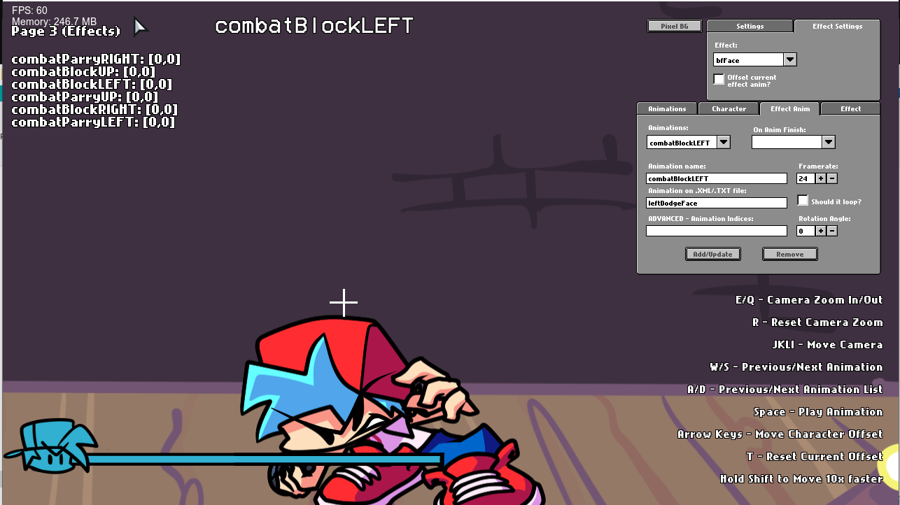

# The For Friday Combat Foundation
"For Friday" is a combat system designed to set a foundation to support a full system of combat for the game Friday Night Funkin'
## Installation:
To put it shortly, this current engine uses the 0.6.3 Psych Engine, so installation instructions are identical to that version's requirements.
The main reason this is version 0.6.3 instead of a more recent 0.7 version is because the later versions are much more difficult to get to compile, and are generally less stable for source modding.
Even the main dev has admitted this, though I'm unsure if this has change as of recent.

Either way, it's just a lot less of a headache getting the libraries right for this version. If you can compile 0.6.3 Psych, you're good to go on this one.

## Credits:
* A Guy Named Guy - Artist, Programmer, and Composer
* Psych Engine Team + Everyone Else - I did NOT make the engine, all credits are maintained within the mod itself and *should be kept there at all times*
_____________________________________

# Features

## An In-Depth, Versatile Combat System
* The core draw of this system: A nuanced series of mechanics that supports a one-on-one duel with the opponent
* Various attack and defense actions that structures a strategy for both approaching the opponent as well as utilizing the player's current toolset
* It's much easier to see all this by playing or watching a video, it gets complicated really fast

## Mod Support
* In addition to the default mod support, support for extra features are also included for modding
* However, source modding is still the no. 1 recommended method since Lua hasn't been thoroughly supported for combat features
* Most features like tutorials, character effects, character selection, etc. have been softcoded for general development convenience
* Basically you can mod using existing mechanics, it's just that trying to make something new may be a challenge without source modding
* This is subject to change! But most likely will come with an official release of some original content using this system far in the future

## Charting-Based Combat

* You can now chart "Event" notes, which are bookmarks that trigger specific actions that usually were hardcoded on the vanilla version of the game.
* Your song's BPM can now have decimal values
* You can manually adjust a Note's strum time if you're really going for milisecond precision
* You can change a note's type on the Editor, it comes with two example types:
  * Alt Animation: Forces an alt animation to play, useful for songs like Ugh/Stress
  * Hey: Forces a "Hey" animation instead of the base Sing animation, if Boyfriend hits this note, Girlfriend will do a "Hey!" too.

## Multiple editors to assist you in making your own Mod

* Working both for Source code modding and Downloaded builds!

## Story mode menu rework:

* Added a different BG to every song (less Tutorial)
* All menu characters are now in individual spritesheets, makes modding it easier.

## Credits menu

* You can add a head icon, name, description and a Redirect link for when the player presses Enter while the item is currently selected.

## Awards/Achievements
* The engine comes with 16 example achievements that you can mess with and learn how it works (Check Achievements.hx and search for "checkForAchievement" on PlayState.hx)

## Options menu:
* You can change Note colors, Delay and Combo Offset, Controls and Preferences there.
 * On Preferences you can toggle Downscroll, Middlescroll, Anti-Aliasing, Framerate, Low Quality, Note Splashes, Flashing Lights, etc.

## Other gameplay features:
* When the enemy hits a note, their strum note also glows.
* Lag doesn't impact the camera movement and player icon scaling anymore.
* Some stuff based on Week 7's changes has been put in (Background colors on Freeplay, Note splashes)
* You can reset your Score on Freeplay/Story Mode by pressing Reset button.
* You can listen to a song or adjust Scroll Speed/Damage taken/etc. on Freeplay by pressing Space.
